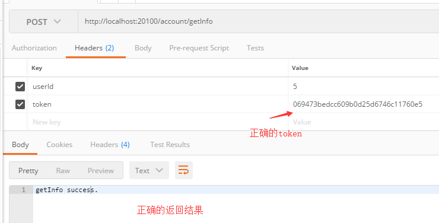
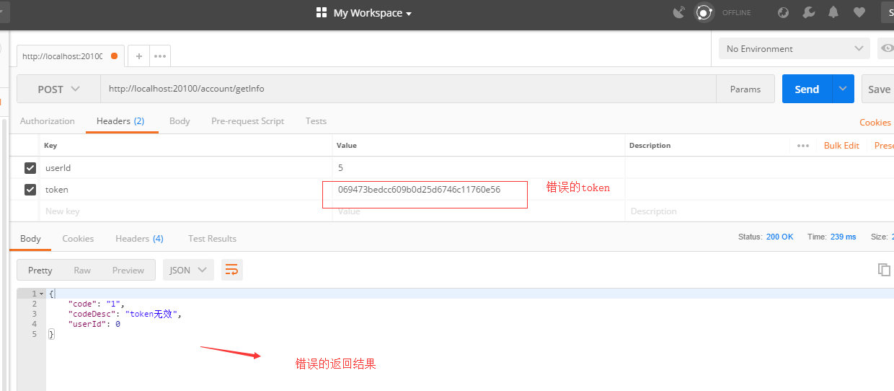

# jpassport
## 1.概述
jpassport是根据token机制实现的登录权限校验模块。**经历了大型社交网络的生产环境考验，能应对高并发场景，可以集群化部署**<br/>
Passport for Java project via userId and token <br/><br/>

**GitHub**地址为[https://github.com/liushaoming/jpassport](https://github.com/liushaoming/jpassport)

建议访问GitHub以获取作者的更多分布式项目源码[https://github.com/liushaoming?tab=repositories](https://github.com/liushaoming?tab=repositories)

**jseckill是怎么诞生的？**

作者[liushaoming](https://github.com/liushaoming) 之前在做公司的一个大型社交类App后台项目中，开发了这个登录模块。当时是用Spring MVC做的，<br/> 
后来开源出来，现在改成了最新的Spring Boot2.X 。经过大型社交网络系统的高并发场景的长期考验。说明了 <br/>
**jseckill能够支撑起大型互联网项目**
 

为什么需要token机制来进行权限校验呢？<br/>

在分布式环境中，因为站点是集群的，不可能使用tomcat的session来保存用户的登录状态。微服务架构也需要<br/>
做成无状态的服务，这就需要token机制来做用户权限校验了。 <br/>
这里，基于Spring的Interceptor来拦截指定的需要权限验证的<br/>
Controller里的method，去校验userId + token。就可以实现它。<br/>


## 2.技术选型

1.Spring + Spring Boot 2.X + MyBatis. 可用于SpringMVC或者SpringBoot项目<br/>
2.maven3.0 <br/>
3.Jdk1.8+ <br/>
4.mysql或者其他的数据库 <br/>
5.Redis <br/>

## 3.jpassport-lib权限认证模块的使用
如何使用jpassport-lib库，参考项目<code>jpassport-web</code>  <br/>

Usage: <br/>
Step1: 
```shell
git clone https://github.com/liushaoming/jpassport.git 
```  
<br/>
Step2: 安装fpassport-lib.jar到本地的maven仓库 <br/>
进入fpassport-lib目录

```shell
cd jpassport-lib
mvn install
```
<br/>

Step3: 在你自己的SpringMVC或者SpringBoot项目中引用fpassport-lib.jar <br/>
在自己的项目的pom.xml中增加下面的依赖
```xml
<dependency>
    <groupId>com.appjishu</groupId>
    <artifactId>jpassport-lib</artifactId>
    <version>1.0.0-SNAPSHOT</version>
</dependency>
```
<br/>

Step4. 数据库建表SQL在doc/db/xxx.sql <br/>
根据fly_token.sql和fly_user.sql建立两个表fly_token和fly_user <br/>
把flylib-site里面的resources/property/jdbc.properties和redis.properties改成自己的数据库和redis配置
 <br/>
 
 Step5. 启动jpassport-web项目（或者你自己的项目)
 在IDEA/eclipse里，找到jpassport-web下的App.java， 右键--Debug
 
 打开浏览器，访问
 ```text
http://localhost:20100/
```
正常情况，浏览器会显示文本如下
```text
this is jpassport home page.
```


 ## 4.测试
 
 下面是一些测试url<br/><br/>
 注册账号--
 <a href="http://localhost:20100/passport/register?username=13011111111&password=123456&accountType=1">http://localhost:20100/passport/register?username=13011111111&password=123456&accountType=1</a>
 <br/>
 用手机号作为用户名登录,并获取token--
 <br/><br/>
 <a href="http://localhost:20100/passport/login?username=13011111111&password=123456&accountType=1">
 http://localhost:20100/passport/login?username=13011111111&password=123456&accountType=1
 </a><br/><br/>
 登录成功后，后台会返回token给前端， 前端调用任何需要认证的所有http接口都需要在请求头（headers）带上参数userId和token
 例如--<br/>
```
url: http://localhost:20100/account/getInfo
type: post
headers: 
        userId=5
        token=069473bedcc609b0d25d6746c11760e5
```
你可以用postman来测试，效果图如下


<br/><br/><br/>

<br/>

## 5.源码分析

**核心原理概述**
使用Spring Web的Interceptor来拦截http request里的header里的参数userId,token

后台认证， 对比存在Redis中的token （持久化到了MySQL里）

token,在注册时候生成，在用户修改密码后，token会被后台更新，踢掉别的客户端操作。

token存在Redis里，适合分布式认证的场景。属于轻量级的可靠认证。


### 5.1 指定特定的Controller，让它里面的所有的action都被登录校验 
使用了注解<code>@AuthController</code> <br/>
同时使用了<code>org.flylib.passport.intercepter.LoginInterceptor</code>

LoginInterceptor的主要代码
```java
@Override
public boolean preHandle(HttpServletRequest request, HttpServletResponse response, Object handler)
        throws Exception {

    if (handler.getClass().isAssignableFrom(HandlerMethod.class)) {
        HandlerMethod handlerMethod = (HandlerMethod) handler;
        logger.info("进入拦截器...........");
        Object controller = handlerMethod.getBean();
        printParameters(request, controller);
        // 访问需要登录的接口那些
        // 被@AuthController注解的Controller
        boolean present = controller.getClass().isAnnotationPresent(AuthController.class);
        if (!present) {
            return true;
        }

        String userIdStr = request.getHeader("userId");
        String token = request.getHeader("token");

        if (!StringUtils.isEmpty(userIdStr)) {
            logger.info("访问需要登录的接口(Authed)...........");
            if (StringUtils.isEmpty(token)) {
                flushError(response, AuthResponseCode.TOKEN_IS_NULL, AuthResponseCode.TOKEN_IS_NULL_DESC);
                return false;
            }
            Passport passport = loginIntercepterService.getPassport(Long.valueOf(userIdStr));
            String storedToken = passport.getToken();
            if (StringUtils.isEmpty(storedToken)) {
                flushError(response, AuthResponseCode.TOKEN_EXPIRED, AuthResponseCode.TOKEN_EXPIRED_DESC);
                return false;
            } else if (!storedToken.equals(token)) {
                flushError(response, AuthResponseCode.TOKEN_INVALID, AuthResponseCode.TOKEN_INVALID_DESC);
                return false;
            }

        } else {
            flushError(response, AuthResponseCode.USER_ID_IS_NULL, AuthResponseCode.USER_ID_IS_NULL_DESC);
            return false;
        }
        // 被@AuthController注解的 结束

    }

    boolean flag = isPermission(request, response);
    logger.info("isPermission:" + flag);
    return flag;
}
```
会去判断客户端当前访问的Controller是否被<code>@AuthController</code>注解<br/>
如果被它注解，了就会进入权限鉴定逻辑。 <br/>
鉴权逻辑，会提取http headers里面的userId和token值。<br/>
后台根据userId去redis查询正确的token（如果没有就去数据库中查询，redis提高了访问数据速度）<br/>
如果存储的token跟header里的token相等，则LoginInterceptor给与放行，继续执行MVC里的业务逻辑;<br/>
否则，拒绝放行，就是直接把报错的code和codeDes描述以json字符串返回给http客户端。<br/>

## 6. Q&A 答疑
### 6.1 关于为什么把userId和token放在header里
本来可以放在http parameter（http body）里。 因为http参数里面可能有很多用户自己的参数<br/>
都放在一起会比较混乱。 比较规范的做法是把这些权限认证之类的放在请求头headers里

### 6.2 userId和token在客户端存放在哪里
http客户端，需要存放在cookie中，每次请求的时候，需要从cookie中读取； <br/>
Android客户端，可以存放在SharedPreferences里面；<br/>
<br/>

### 6.3 为什么使用Spring Boot 2.X ?
因为Spring Boot适合快速构建Spring应用。 而且这里及时更新到Spring Boot 2.X。 
免去了获取代码的程序员自己去升级。开箱即用。

## 联系作者
|  联系方式 |  |
| :-------- | :-------- |
| **Leader** | liushaoming |
| email | [liushaomingdev@163.com](mailto:liushaomingdev@163.com) |
| QQ | 944147540 |


有代码改进优化的建议的统一在Issues里面提
<br/>
加群讨论 
<br/>

<br/>


